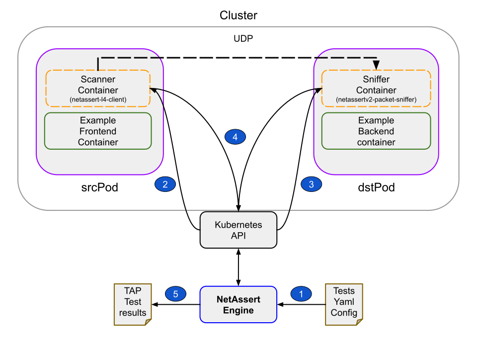
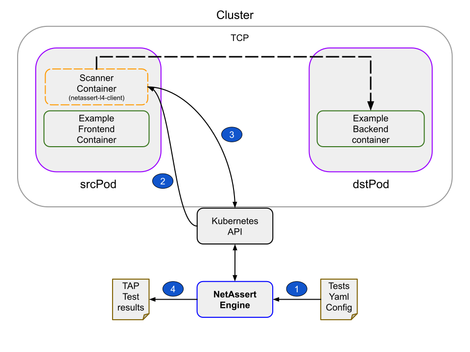

# Netassert

[![Testing Workflow][testing_workflow_badge]][testing_workflow_badge]
[![Release Workflow][release_workflow_badge]][release_workflow_badge]

`NetAssert` is a command line tool that enables you to check the network connectivity between Kubernetes objects such as Pods, Deployments, DaemonSets, and StatefulSets, as well as test their connectivity to remote hosts or IP addresses. `NetAssert` v2 is a rewrite of original `NetAssert` tool in Go that utilises the ephemeral container support in Kubernetes to verify network connectivity. `NetAssert` test(s) are defined in YAML format. `NetAssert` **currently supports TCP and UDP protocols**:

- To perform a TCP test, only a [`scanner`](https://github.com/controlplaneio/netassertv2-l4-client) container is used. This container requires no privileges nor any Linux capabilities.

- To run a UDP test, a [`sniffer`](https://github.com/controlplaneio/netassertv2-packet-sniffer) ephemeral container is injected into the target Pod which requires `cap_raw` capabilities to read data from the network interface. During UDP testing, `NetAssert` runs both container `scanner` and `sniffer` container images which are injected as `ephemeral` containers into running Pods.

The [`sniffer`](https://github.com/controlplaneio/netassertv2-packet-sniffer) and [`scanner`](https://github.com/controlplaneio/netassertv2-l4-client)  container images can be downloaded from:

- `docker.io/controlplane/netassertv2-l4-client:latest`
  - Used for both TCP and UDP testing and acts as a Layer 4 (TCP/UDP) client
  - Requires no privileges nor any Linux capabilities.
- `docker.io/controlplane/netassertv2-packet-sniffer:latest`
  - Used for UDP testing only, injected at the destination to capture packet and search for specific string in the payload
  - requires `cap_raw` capabilities to read data from the network interface

`NetAssert` utilises the above containers during test and configures them using *environment variables*. The list of environment variables that are used can be found [here](https://github.com/controlplaneio/netassertv2-packet-sniffer) and [here](https://github.com/controlplaneio/netassertv2-l4-client). It is possible to override the `sniffer` and `scanner` images from command line during a run, so one can also bring their own container image(s) as long as they support the same environment variables.


## Installation

- Please download the latest stable version of `NetAssert` from [releases](https://github.com/controlplaneio/netassert/releases) page. The binary is available for Linux, MacOS and Windows platforms.

- If you are on Unix/Linux, you can also use the [download.sh](./download.sh) script to download the latest version of `NetAssert` into the current path:

```bash
curl -sL https://raw.githubusercontent.com/controlplaneio/netassert/master/download.sh | bash
```

## Test specification

`NetAssert` v2 tests are written in YAML format. Each test is a YAML document which supports the following mappings:

- A YAML document is a list of `NetAssert` test. Each test has the following keys:
  - **name**: a scalar representing the name of the connection
  - **type**: a scalar representing the type of connection, only "k8s" is supported at this time
  - **protocol**: a scalar representing the protocol used for the connection, which must be "tcp" or "udp"
  - **targetPort**: an integer scalar representing the target port used by the connection
  - **timeoutSeconds**: an integer scalar representing the timeout for the connection in seconds
  - **attempts**: an integer scalar representing the number of connection attempts for the test
  - **exitCode**: an integer scalar representing the expected exit code from the ephemeral/debug container(s)
  - **src**: a mapping representing the source Kubernetes resource, which has the following keys:
    - **k8sResource**: a mapping representing a Kubernetes resource with the following keys:
      - **kind**: a scalar representing the kind of the Kubernetes resource, which can be `deployment`, `statefulset`, `daemonset` or `pod`
      - **name**: a scalar representing the name of the Kubernetes resource
      - **namespace**: a scalar representing the namespace of the Kubernetes resource
  - **dst**: a mapping representing the destination Kubernetes resource or host, **which can have one of the the following keys** i.e both `k8sResource` and `host` **are not supported at the same time** :
    - **k8sResource**: a mapping representing a Kubernetes resource with the following keys:
      - **kind**: a scalar representing the kind of the Kubernetes resource, which can be `deployment`, `statefulset`, `daemonset` or `pod`
      - **name**: a scalar representing the name of the Kubernetes resource
      - **namespace**: a scalar representing the namespace of the Kubernetes resource. (Note: Only allowed when protocol is "tcp")
    - **host**: a mapping representing a host/node with the following key:
      - **name**: a scalar representing the name or IP address of the host/node. (Note: Only allowed when protocol is "tcp" or "udp", but not both at the same time)

<details><summary>This is an example of a test that can be consumed by `NetAssert` utility</summary>

```yaml
---
- name: busybox-deploy-to-echoserver-deploy
  type: k8s
  protocol: tcp
  targetPort: 8080
  timeoutSeconds: 67
  attempts: 3
  exitCode: 0
  src:
    k8sResource:
      kind: deployment
      name: busybox
      namespace: busybox
  dst:
    k8sResource:
      kind: deployment
      name: echoserver
      namespace: echoserver
#######
#######
- name: busybox-deploy-to-core-dns
  type: k8s
  protocol: udp
  targetPort: 53
  timeoutSeconds: 67
  attempts: 3
  exitCode: 0
  src:
    k8sResource:
      kind: deployment
      name: busybox
      namespace: busybox
  dst:
    k8sResource:
      kind: deployment
      name: coredns
      namespace: kube-system
######
######
- name: busybox-deploy-to-web-statefulset
  type: k8s
  protocol: tcp
  targetPort: 80
  timeoutSeconds: 67
  attempts: 3
  exitCode: 0
  src:
    k8sResource: # this is type endpoint
      kind: deployment
      name: busybox
      namespace: busybox
  dst:
    k8sResource: ## this is type endpoint
      kind: statefulset
      name: web
      namespace: web
###
###
- name: fluentd-daemonset-to-web-statefulset
  type: k8s
  protocol: tcp
  targetPort: 80
  timeoutSeconds: 67
  attempts: 3
  exitCode: 0
  src:
    k8sResource: # this is type endpoint
      kind: daemonset
      name: fluentd
      namespace: fluentd
  dst:
    k8sResource: ## this is type endpoint
      kind: statefulset
      name: web
      namespace: web
###
####
- name: busybox-deploy-to-control-plane-dot-io
  type: k8s
  protocol: tcp
  targetPort: 80
  timeoutSeconds: 67
  attempts: 3
  exitCode: 0
  src:
    k8sResource: # type endpoint
      kind: deployment
      name: busybox
      namespace: busybox
  dst:
    host: # type host or node or machine
      name: control-plane.io
###
###
- name: test-from-pod1-to-pod2
  type: k8s
  protocol: tcp
  targetPort: 80
  timeoutSeconds: 67
  attempts: 3
  exitCode: 0
  src:
    k8sResource: ##
      kind: pod
      name: pod1
      namespace: pod1
  dst:
    k8sResource:
      kind: pod
      name: pod2
      namespace: pod2
###
###
- name: busybox-deploy-to-fake-host
  type: k8s
  protocol: tcp
  targetPort: 333
  timeoutSeconds: 67
  attempts: 3
  exitCode: 1
  src:
    k8sResource: # type endpoint
      kind: deployment
      name: busybox
      namespace: busybox
  dst:
    host: # type host or node or machine
      name: 0.0.0.0
...
```

</details>

## Components

`NetAssert` has three main components:

- [NetAssert](https://github.com/controlplaneio/netassert): This is responsible for orchestrating the tests and is also known as `Netassert-Engine` or simply the `Engine`
- [NetAssertv2-packet-sniffer](https://github.com/controlplaneio/netassertv2-packet-sniffer): This is the sniffer component that is utilised during a UDP test and is injected to the destination/target Pod as an ephemeral container
- [NetAssertv2-l4-client](https://github.com/controlplaneio/netassertv2-l4-client): This is the scanner component that is injected as the scanner ephemeral container onto the source Pod and is utilised during both TCP and UDP tests

## Detailed steps/flow of tests

All the tests are read from an YAML file or a directory (step **1**) and the results are written following the [TAP format](https://testanything.org/) (step **5** for UDP and step **4** for TCP). The tests are performed in two different manners depending on whether a TCP or UDP connection is used

### UDP test



- Validate the test spec and ensure that the `src` and `dst` fields are correct: for udp tests both of them must be of type `k8sResource`
- Find a running Pod called `dstPod` in the object defined by the `dst.k8sResource` field. Ensure that the Pod is in running state and has an IP address allocated by the CNI
- Find a running Pod called `srcPod` in the object defined by the `src.k8sResource` field. Ensure that the Pod is in running state and has an IP address allocated by the CNI
- Generate a random UUID, which will be used by both ephemeral containers
- Inject the `netassert-l4-client` as an ephemeral container in the `srcPod` (step **2**) and set the port and protocol according to the test specifications. Provide also the target host equal to the previously found dstPod IP address, and the random UUID that was generated in the previous step as the message to be sent over the udp connection. At the same time, inject the `netassertv2-packet-sniffer` (step **3**) as an ephemeral container in the `dstPod` using the protocol, search string, number of matches and timeout defined in the test specifications. The search_string environment variable is equal to the UUID that was generated in the previous step which is expected to be found in the data sent by the scanner when the connections are successful.
- Poll that status of the ephemeral containers (step **4**)
- Ensure that the `netassertv2-packet-sniffer` ephemeral sniffer container’s exit status matches the one defined in the test specification
- Ensure that the `netassert-l4-client`, exits with exit status of zero. This should always be the case as UDP is not a connection oriented protocol.

### TCP test



- Validate the test spec and ensure that the `src` field is of type `k8sResource`
- Find a running Pod called `srcPod` in the object defined by the `src.k8sResource` field. Ensure that the Pod is in running state and has an IPAddress
- Check if `dst` has `k8sResource` defined as a child object. If so then find a running Pod defined by the `dst.K8sResource`
- Inject the `netassert-l4-client` as an ephemeral container in the `srcPod` (step **2**). Configure the `netassert-l4-client` similarly to the udp case. If the `dst` field is set to `host` then use the host `name` field as the scanner target host
- Poll that status of the ephemeral containers (step **3**)
- Ensure that the exit code of that container matches the `exitCode` field defined in the test specification

## Development

- You will need Go version 1.25.x or higher. Download the latest version of [just](https://github.com/casey/just/releases). To build the project you can use `just build`. The resulting binary will be in `cmd/netassert/cli/netassert`. To run `unit` tests you can use `just test`. There is a separate [README.md](./e2e/README.md) that details `end-to-end` testing.

## Quick testing

### Spinning up the environment

- Make sure you have installed [`kind`](https://kind.sigs.k8s.io/) and its prerequisites
- Make sure you have also installed [`just`](https://github.com/casey/just/releases)
- Download the `NetAssert` binary from the [release](https://github.com/controlplaneio/netassert/releases) page:

```bash
❯ VERSION="v2.1.3" # change it to the version you want to install
❯ OS_DISTRO=linux_amd64 # change it to your OS_DISTRO (for reference check the NetAssert release page)
❯ curl -L -o netassert.tar.gz https://github.com/controlplaneio/netassert/releases/download/${VERSION}/netassert_${VERSION}_${OS_ARCH}.tar.gz

❯ tar -xzf netassert.tar.gz -C bin/netassert
```

- Alternatively, you can build `NetAssert` from source:
```bash
❯ just build
```

- You will also need a working kubernetes cluster with ephemeral/debug container support and a CNI that supports Network Policies, you can spin one quickly using the `justfile` included in the repo:

```bash
❯ just kind-down ; just kind-up
❯ just calico-apply
```

- wait for all the nodes to become ready:
```bash
❯ kubectl get nodes -w
```

### Running the sample tests

- In order to use the sample tests, you need to create network policies and kubernetes resources:

```bash
❯ just k8s-apply
  kubectl apply -f ./e2e/manifests/workload.yaml
  namespace/fluentd created
  daemonset.apps/fluentd created
  namespace/echoserver created
  namespace/busybox created
  deployment.apps/echoserver created
  deployment.apps/busybox created
  namespace/pod1 created
  namespace/pod2 created
  pod/pod2 created
  pod/pod1 created
  namespace/web created
  statefulset.apps/web created
```

```bash
❯ just netpol-apply
  kubectl apply -f ./e2e/manifests/networkpolicies.yaml
  networkpolicy.networking.k8s.io/web created
```

- Wait for the workload to become ready (note that the workload pods are the ones created after running `just k8s-apply` in a previous step):
```bash
❯ kubectl get pods -A
  busybox              busybox-6c85d76fdc-r8gtp                            1/1     Running   0          76s
  echoserver           echoserver-64bd7c5dc6-ldwh9                         1/1     Running   0          76s
  fluentd              fluentd-5pp9c                                       1/1     Running   0          76s
  fluentd              fluentd-8vvp9                                       1/1     Running   0          76s
  fluentd              fluentd-9jblb                                       1/1     Running   0          76s
  fluentd              fluentd-jnlql                                       1/1     Running   0          76s
  kube-system          calico-kube-controllers-565c89d6df-8mwk9            1/1     Running   0          117s
  kube-system          calico-node-2sqhw                                   1/1     Running   0          117s
  kube-system          calico-node-4sxpn                                   1/1     Running   0          117s
  kube-system          calico-node-5gtg7                                   1/1     Running   0          117s
  kube-system          calico-node-kxjq8                                   1/1     Running   0          117s
  kube-system          coredns-7d764666f9-74xgb                            1/1     Running   0          2m29s
  kube-system          coredns-7d764666f9-jvnr4                            1/1     Running   0          2m29s
  kube-system          etcd-packet-test-control-plane                      1/1     Running   0          2m35s
  kube-system          kube-apiserver-packet-test-control-plane            1/1     Running   0          2m35s
  kube-system          kube-controller-manager-packet-test-control-plane   1/1     Running   0          2m35s
  kube-system          kube-proxy-4xjp2                                    1/1     Running   0          2m27s
  kube-system          kube-proxy-b28pw                                    1/1     Running   0          2m29s
  kube-system          kube-proxy-p9smj                                    1/1     Running   0          2m27s
  kube-system          kube-proxy-xb2wq                                    1/1     Running   0          2m27s
  kube-system          kube-scheduler-packet-test-control-plane            1/1     Running   0          2m35s
  local-path-storage   local-path-provisioner-67b8995b4b-jf8lc             1/1     Running   0          2m29s
  pod1                 pod1                                                1/1     Running   0          75s
  pod2                 pod2                                                1/1     Running   0          76s
  web                  web-0                                               1/1     Running   0          75s
  web                  web-1                                               1/1     Running   0          31s
```
- Run the netassert binary pointing it to the test cases:

```bash
❯ bin/netassert run --input-file ./e2e/manifests/test-cases.yaml

❯ cat results.tap 
TAP version 14
1..9
ok 1 - busybox-deploy-to-echoserver-deploy
ok 2 - busybox-deploy-to-echoserver-deploy-2
ok 3 - fluentd-deamonset-to-echoserver-deploy
ok 4 - busybox-deploy-to-web-statefulset
ok 5 - web-statefulset-to-busybox-deploy
ok 6 - fluentd-daemonset-to-web-statefulset
ok 7 - busybox-deploy-to-control-plane-dot-io
ok 8 - test-from-pod1-to-pod2
ok 9 - busybox-deploy-to-fake-host
```

- To see the results when a check fails, run:

```bash
❯ just netpol-rm-apply
  kubectl delete -f ./e2e/manifests/networkpolicies.yaml
  networkpolicy.networking.k8s.io "web" deleted

❯ bin/netassert run --input-file ./e2e/manifests/test-cases.yaml

❯ cat results.tap
TAP version 14
1..9
ok 1 - busybox-deploy-to-echoserver-deploy
ok 2 - busybox-deploy-to-echoserver-deploy-2
ok 3 - fluentd-deamonset-to-echoserver-deploy
ok 4 - busybox-deploy-to-web-statefulset
not ok 5 - web-statefulset-to-busybox-deploy
  ---
  reason: ephemeral container netassertv2-client-aihlpxcys exit code for test web-statefulset-to-busybox-deploy
  is 0 instead of 1
  ...
ok 6 - fluentd-daemonset-to-web-statefulset
ok 7 - busybox-deploy-to-control-plane-dot-io
ok 8 - test-from-pod1-to-pod2
ok 9 - busybox-deploy-to-fake-host
```

## Compatibility

NetAssert is architected for compatibility with Kubernetes versions that offer support for ephemeral containers. We have thoroughly tested NetAssert with Kubernetes versions 1.25 to 1.35, confirming compatibility and performance stability.

For broader validation, our team has also executed comprehensive [end-to-end tests](./e2e/README.md) against various Kubernetes distributions and CNIs which is detailed below:

| Kubernetes Distribution | Supported Version | Container Network Interface (CNI) |
|-------------------------|-------------------|------------------------------------
| Amazon EKS              | 1.34 and higher   | AWS VPC CNI                       |
| Amazon EKS              | 1.34 and higher   | Calico (Version 3.26 or later)    |
| Google GKE              | 1.33 and higher   | Google Cloud Platform VPC CNI     |
| Google GKE              | 1.33 and higher   | Google Cloud Dataplane V2         |

## Checking for ephemeral container support

You can check for ephemeral container support using the following command:

```bash
❯ netassert ping
2023-03-27T11:25:28.421+0100 [INFO]  [NetAssert-v2.0.0]: ✅ Successfully pinged /healthz endpoint of the Kubernetes server
2023-03-27T11:25:28.425+0100 [INFO]  [NetAssert-v2.0.0]: ✅ Ephemeral containers are supported by the Kubernetes server
```

## Increasing logging verbosity

You can increase the logging level to `debug` by passing `--log-level` argument:

```bash
❯ netassert run --input-file ./e2e/manifests/test-cases.yaml --log-level=debug
```

## RBAC Configuration

This tool can be run according to the Principle of Least Privilege (PoLP) by properly configuring the RBAC.

The list of required permissions can be found in the `netassert` ClusterRole `rbac/cluster-role.yaml`, which could be redefined as a Role for namespacing reasons if needed. This role can then be bound to a "principal" either through a RoleBinding or a ClusterRoleBinding, depending on whether the scope of the role is supposed to be namespaced or not. The ClusterRoleBinding `rbac/cluster-rolebinding.yaml` is an example where the user `netassert-user` is assigned the role `netassert` using a cluster-wide binding called `netassert`

## Limitations

- When performing UDP scanning, the sniffer container [image](https://github.com/controlplaneio/netassertv2-packet-sniffer) needs `cap_net_raw` capability so that it can bind and read packets from the network interface. As a result, admission controllers or other security mechanisms must be modified to allow the `sniffer` image to run with this capability. Currently, the Security context used by the ephemeral sniffer container looks like the following:

```yaml
...
...
   securityContext:
     allowPrivilegeEscalation: false
     capabilities:
       add:
       - NET_RAW
     runAsNonRoot: true
...
...
```

- Although they do not consume any resources, ephemeral containers that are injected as part of the test(s) by `NetAssert` will remain in the Pod specification

- Service meshes are not be currently supported

## E2E Tests

- Please check this [README.md](./e2e/README.md)

[testing_workflow_badge]: https://github.com/controlplaneio/netassert/actions/workflows/build.yaml/badge.svg

[release_workflow_badge]: https://github.com/controlplaneio/netassert/actions/workflows/release.yaml/badge.svg
